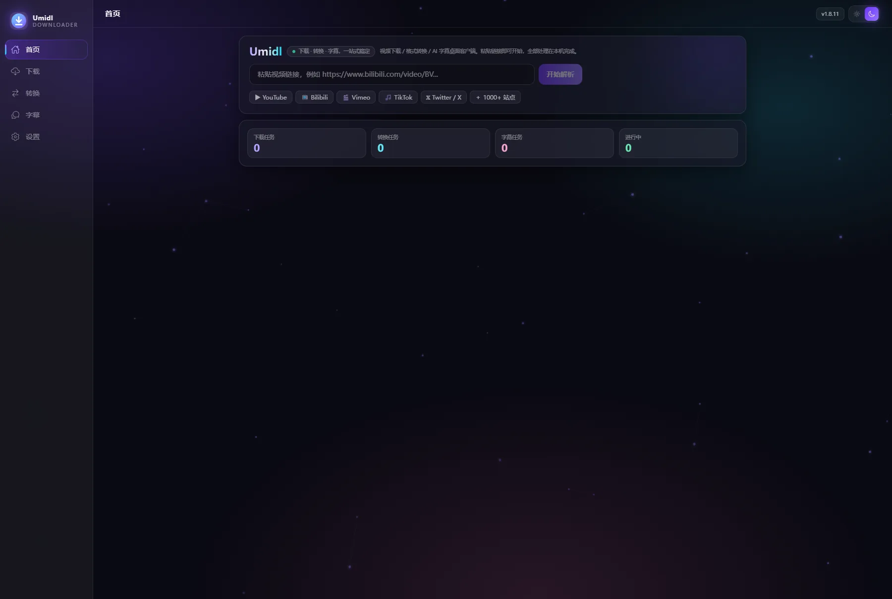

<div align="center">


# Umidl

**Lightweight, good-looking, high-performance desktop client for video download / format conversion / AI subtitles**

Download + convert + subtitles, all in one place. Built with **Tauri 2 + Rust + Vue 3**, installer **4.46 MiB**, and all processing happens **on your own machine** — nothing is uploaded, no account, no telemetry.

[](LICENSE)
[](#-platform-support)
[](https://tauri.app)
[](https://vuejs.org)
[](https://github.com/HuanMoovo/umidl/releases)
[](#ui-and-themes)

[Quick start](#-quick-start) · [What it does](#-what-it-does) · [Features](#-features) · [Platform support](#-platform-support) · [Contributing](CONTRIBUTING.md) · [Project page](https://huanmoovo.github.io/umidl/) · [Roadmap](docs/ROADMAP.md)

<sub><a href="README.md">简体中文</a> · English · <a href="README.ja.md">日本語</a></sub>

<a href="https://huanmoovo.github.io/umidl/">
  
</a>

<sub>Umidl 1.8.11 main window (screenshot from a real Windows machine, sandboxed data directory) · <a href="https://huanmoovo.github.io/umidl/#screens">See all 7 interface screenshots</a></sub>

</div>

---

## 🎯 What it does

**Runs the whole "download → convert → subtitles" chain on your own machine** — installer 4.46 MiB (measured on the 1.8.11 Windows NSIS build).

| Capability | Status (1.8.11; verifiable from the repository and the application UI) |
| --- | --- |
| **Local processing, nothing uploaded** | The entire pipeline runs in local processes: no account, no telemetry, no cloud parsing; uninstalling the app or deleting the data directory clears all state |
| **Download** | Two pipelines auto-routed by link type (yt-dlp site extraction / aria2c segmented parallel); multi-part videos, collections and HLS/DASH merged automatically; pause, resume, global speed limit |
| **Format conversion** | 80 target formats (video 22 · audio 20 · image 20 · document 18), availability decided by probing the local engine capabilities; docx / xlsx / pptx / odt / ods / odp parsed natively in pure Rust; NVENC / QSV / AMF hardware encoding supported |
| **Subtitles** | Whisper.cpp transcribes locally; recognition language is auto-detection plus 8 selectable languages, with an optional "translate to English" track on top; exports SRT / ASS / VTT / TXT / JSON; 6 model tiers downloaded on demand |
| **Plugins** | QuickJS sandbox with hard caps of 16 MB memory / 512 KB stack / 200 ms per execution; allow-listed API (no `require` / `process` / `fetch`); plugins verified by content-addressed sha256 |
| **Cross-platform** | The same source tree builds on Windows / macOS / Linux; see [Platform support](#-platform-support) for each platform's artifact status and level of verification |


---

## 🚀 Quick start

### Windows (released)

1. Download `Umidl_x.y.z_x64-setup.exe` from [Releases](https://github.com/HuanMoovo/umidl/releases) (1.8.11 installer: **4.46 MiB**)
2. The first launch detects runtime tools such as yt-dlp / FFmpeg / Whisper automatically; anything missing can be installed with one click under "Settings → Dependencies" (installed into `%APPDATA%/umi-downloader/bin`, **never written to the system PATH**)
3. Paste a link → pick a quality → start the download

### macOS / Linux (built from source; installers produced by CI)

```bash
git clone https://github.com/HuanMoovo/umidl.git
cd umidl
npm ci

# Linux: install the system dependencies first (same as CI)
sudo apt-get install -y libwebkit2gtk-4.1-dev libappindicator3-dev librsvg2-dev patchelf

npm run tauri:dev      # dev mode (hot reload)
npm run tauri:build    # build locally: .dmg / .AppImage / .deb
```

- **Where CI artifacts live**: Actions → the `Release` workflow → Artifacts of the corresponding run (`umidl-windows-x64` / `umidl-macos-arm64` / `umidl-macos-x64` / `umidl-linux-x64`); all four targets ship with [v1.8.11](https://github.com/HuanMoovo/umidl/releases). The Intel macOS dmg is cross-compiled on an arm64 runner (command in [CONTRIBUTING.md](CONTRIBUTING.md)).
- macOS / Linux are currently **built by CI only** and have not been through a full regression on real hardware; aria2 has no official static build on these two platforms, so the install guide points to `brew` / `apt`.

### Requirements (source builds)

- **Node ≥ 20**, **Rust stable ≥ 1.77**, plus Python 3 (for the helper scripts under `scripts/`)
- Windows: MSVC build tools + WebView2 (bundled with Win11); macOS: Xcode Command Line Tools; Linux: see the apt dependencies above

See [CONTRIBUTING.md](CONTRIBUTING.md) for the full development workflow.

---

## 💻 Platform support

| Platform | Architecture | Artifact | Status |
| --- | --- | --- | --- |
| Windows | x64 | NSIS installer `.exe` | ✅ **Released** (1.8.11, 4.46 MiB, regression run on real hardware) |
| macOS | Apple Silicon (arm64) | `.dmg` | ✅ **Released** (1.8.11, 8.96 MiB, CI-built, no on-device regression) |
| macOS | Intel (x64) | `.dmg` | ✅ **Released** (1.8.11, 9.24 MiB, cross-compiled by CI on an arm64 runner, no on-device regression) |
| Linux | x64 | `.AppImage` / `.deb` | ✅ **Released** (1.8.11, deb 6.85 MiB / AppImage 81.4 MiB, CI-built, no on-device regression) |
| Android | — | — | 🔴 Experimental work, needs mobile-side porting; no artifacts provided yet |

---

## ✨ Features

### Download engine (two engines, auto-routed)
- **aria2c segmented parallel engine**: direct links / FTP / BitTorrent torrents / magnet links use 16 dynamic connections (adjustable 1 – 16), with resume after power loss
- **yt-dlp site extraction engine**: video from 1000+ sites, **multi-part videos and collections**, automatic HLS/DASH stream merging
- The engine can be set to "Auto / yt-dlp / aria2" in Settings; auto mode routes by link type
- **Global speed limit (token bucket)**: set a bandwidth ceiling; gateway-level throttling applies to yt-dlp, aria2 and the app's own requests alike, so downloads running in the background do not get in the way of browsing
- **Managed ImageMagick (new in 1.8)**: targets ffmpeg cannot write (PSD/DDS) are handled by the app-managed ImageMagick, still without polluting the system PATH
- **Multi-link / txt batch import (new in 1.6)**: paste several links at once or import a txt file and queue them in bulk; a results panel reports "added / skipped" plus the failure reasons
- **Threads and concurrency (new in 1.6)**: the number of simultaneous tasks and each download's connection count / segment count / minimum chunk size are configurable (applied separately to aria2 and yt-dlp), and out-of-range values are clamped automatically
- **Download queue**: a single table-style list (card mode removed as of V1.8.7, actions trimmed to open / reveal / preview / delete)

### Plugin sandbox (JavaScript · new in 1.5)
- **QuickJS sandbox runtime**: 16 MB memory cap, 512 KB stack cap, 200 ms execution time budget per run; scripts that overstep their privileges are really interrupted (`while(true)` is stopped as well), and `require` / `process` / `fetch` / file APIs are not injected
- **Allow-listed capabilities**: only `umi.log / resolve / registerResolver / on / retry / storage` are exposed
- **Link resolvers**: resolvers registered by plugins take part in deciding "which engine this link goes to", and the settings page shows the plugins' opinions in real time
- **Notification hooks + imperative retry**: `download:done` / `download:error` / `app:start` events are pushed to plugins, and a plugin can call `umi.retry(taskId)` to retry a failed task (with a built-in attempt cap, so it never retries endlessly)
- **Plugin market (content-addressed verification)**: built-in sample plugins install with one click; **sha256** is compared before installation, and a file changed by a single byte is refused
- Plugin management lives under **Settings → Plugins** (moved there from a separate sidebar page in 1.6)

### Video download (yt-dlp core)
- Supports 1000+ sites including YouTube / Bilibili / Vimeo / TikTok
- Parses title, thumbnail, uploader, duration, quality and format
- Visual selection of quality / audio only (MP3 / M4A / FLAC / WAV / OPUS)
- Live progress, speed and time remaining
- **Pause / resume / cancel / delete**
- Embed thumbnail, embed subtitles, custom download directory, speed limit, proxy, cookies

### Format conversion (80 formats · FFmpeg + native parsing + pandoc/poppler)
- **Availability = real engine capability (1.8)**: the available state of all 80 target formats in the catalog is decided by real probing (ffmpeg encoders/muxers + ImageMagick format table + pandoc/poppler), and all of them are available on this machine; availability comes from real probing (ffmpeg encoders/muxers + ImageMagick format table + pandoc/poppler), not from a hard-coded table
- **Unified flow (collapsed into a single card in 1.7)**: file area → one format selector (type chips + search + target format grid) → parameter area shown or hidden by type → one-line engine status bar → queue; the page is about 64% shorter than in 1.6
- **Type options**: five segments — all / video / audio / image / document; the grid shows each format's availability (greyed out with a reason when the local engine does not support it), and formats can be searched by name or description
- **80 in total** (probed on real hardware): video 22 · audio 20 · image 20 · document 18; selecting a different type switches the matching parameter panel (codec / resolution / CRF appear only for video / audio targets)
- **Documents (new in 1.5)**: docx / xlsx / pptx / odt / ods / odp are **parsed natively in pure Rust** into txt / md / html / csv (no external runtime required); pandoc handles conversions between rich formats (docx·odt·rtf·epub·html·md); poppler extracts PDF text; selecting a file immediately shows page / worksheet / slide / character counts
- **Images (new in 1.5)**: PNG / JPG / WEBP / BMP / TIFF / ICO
- Video: MP4 / MKV / MOV / AVI / WEBM / FLV
- Audio: MP3 / AAC / FLAC / WAV / OPUS / M4A
- Codecs: H.264 / H.265(HEVC) / AV1 / VP9
- Resolution scaling, CRF quality presets, audio extraction, audio track removal
- Live transcode progress and cancellation

### AI subtitles (Whisper.cpp core)
- Video → FFmpeg audio extraction → Whisper speech recognition → timeline → export
- Export formats: SRT / ASS / VTT / TXT / JSON
- **Multiple recognition languages (new in 1.6)**: each selected language starts its own task, and "translate to English" can be layered on to produce an additional English track
- Automatic language detection, supporting Chinese / English / Japanese / Korean / French / German / Spanish / Russian
- 6 model tiers (tiny 75MB ~ large-v3 3.1GB), downloaded on demand

### Built-in automated self-test
The "Functional self-test" on the settings page runs a full regression with one click: it really invokes yt-dlp / FFmpeg / Whisper to verify download, conversion, subtitles, the data layer and config read/write item by item.

---

## 🚀 Development

```bash
npm install
npm run tauri:dev      # dev mode (hot reload)
npm run test           # frontend unit tests (vitest)
npm run tauri:build    # build the desktop client (NSIS installer + exe)
```

### Backend self-test (no GUI, runnable in CI)

```bash
cd src-tauri
cargo run --release -- --selftest          # full self-check (real downloads / AI transcription)
cargo run --release -- --selftest --quick  # quick self-check (skips slow cases)
```

---

## 🧱 Technical architecture

```
┌────────────────────────────────────────────────────────┐
│ UI layer     Vue 3 + TS + Tailwind + Naive UI          │
└────────────────────────────┬───────────────────────────┘
                             │  Tauri IPC (invoke / event)
┌────────────────────────────▼───────────────────────────┐
│ Core         Tauri 2 + Rust                            │
│   · task scheduling / cancel / progress parsing        │
│   · SQLite persistence (rusqlite)                      │
└────────────────────────────┬───────────────────────────┘
                             │
┌────────────────────────────▼───────────────────────────┐
│ Services     yt-dlp · FFmpeg · Whisper                 │
└────────────────────────────┬───────────────────────────┘
                             │
┌────────────────────────────▼───────────────────────────┐
│ Data         SQLite + filesystem                       │
└────────────────────────────────────────────────────────┘
```

### Directory structure

```
umi-downloader
├── src                  # frontend
│   ├── views            # Home / Download / Converter / Subtitle / Settings
│   ├── components       # SideBar / TitleBar / TaskCard / ParticleBg
│   ├── services         # ipc / downloader / ffmpeg / whisper / utils
│   ├── stores           # Pinia：tasks / settings
│   └── types            # types shared with the Rust side
├── src-tauri            # backend
│   ├── src
│   │   ├── lib.rs       # Tauri commands and task scheduling
│   │   ├── downloader.rs# yt-dlp integration (extraction / args / progress / resume)
│   │   ├── converter.rs # FFmpeg integration (ffprobe / args / progress)
│   │   ├── subtitle.rs  # Whisper integration (audio extraction / transcription / subtitle formats)
│   │   ├── tools.rs     # tool detection and one-click install
│   │   ├── db.rs        # SQLite layer
│   │   ├── selftest.rs  # automated self-check system
│   │   └── http_testserver.rs # local HTTP server for self-check
│   └── tauri.conf.json
└── scripts/make_brand_assets.py  # brand pipeline: master SVG → PNG/WebP/app icons
```

---

## 🔧 Dependencies

Detected automatically at app startup; anything missing can be installed with one click under "Settings → Dependencies" (downloaded into the app data directory, leaving the system untouched):

| Tool | Purpose | Size |
| --- | --- | --- |
| yt-dlp | Video extraction and download | ~17 MB |
| FFmpeg / FFprobe | Transcoding, muxing, probing | ~80 MB |
| whisper.cpp | AI speech recognition | ~22 MB |
| Whisper models | Speech recognition models | 75 MB ~ 3.1 GB |

Detection order: **user-specified path → app-managed directory → directory beside the main executable → system PATH**.

---

## 📄 Data storage

| Content | Location |
| --- | --- |
| Database / config | `%APPDATA%/umi-downloader/` |
| Managed tools | `%APPDATA%/umi-downloader/bin/` |
| Whisper models | `%APPDATA%/umi-downloader/models/` |
| Default download directory | `%USERPROFILE%/Downloads/Umidl/` |

---

## 🆕 Enhancements (v1.0.0 enhanced build)

### UI and themes
- **Light/dark theme system**: one click in the title bar switches "light / dark / follow system", and follow-system mode tracks the Windows day/night setting automatically; every UI element uses CSS variables, so the switch takes effect immediately without a restart.
- **6 accent colors**: violet / cyan blue / sakura pink / emerald green / amber gold / sky blue; the whole palette (buttons, progress bars, glow, scrollbars) changes with it.
- **Performance optimizations**:
  - Background particles now use pre-rendered glow sprites + spatially bucketed lines + a 30fps frame cap, and can be switched off or set to one of three quality tiers;
  - Download / conversion progress events are throttled (≤4 per second), sharply reducing high-frequency IPC and UI re-renders;
  - Task cards lazy-load thumbnails, with an optional compact mode.

### Video download
- **Thumbnails**: after parsing, the thumbnail is fetched and cached locally (so it still shows offline), and can be clicked to enlarge.
- **Separate downloads**: four independent entries for video / audio / thumbnail / subtitles; subtitles support selecting multiple languages (including the auto-generated subtitle flag).
- **Preview panel**: large thumbnail + title + uploader / view count / likes / duration / upload date + the full quality list + subtitle tracks + description, with one-click opening in the browser.
- **Automatic system proxy detection**: when no proxy is entered manually, the Windows system proxy (Clash / v2ray, etc.) is read automatically; localhost and LAN addresses always connect directly, avoiding 502 errors.

### Format conversion
- **More formats**: 12 video containers (mp4/mkv/mov/webm/avi/flv/ts/m4v/mpg/wmv/ogv/gif) and 10 audio formats (mp3/m4a/aac/flac/wav/opus/ogg/wma/ac3/aiff).
- **More encoders**: libx264 / libx265 / libsvtav1 / libvpx-vp9 / ProRes, plus NVENC / QSV / AMF hardware encoding (each matched with the correct rate-control parameters).
- **Automatic format detection**: after a file is loaded, an output plan is recommended from the source codec — H.264/AAC is remuxed losslessly into MP4, VP9/Opus losslessly into WebM, and lossless audio is kept as FLAC, avoiding pointless re-encoding.
- **Advanced options**: video/audio bitrate, sample rate, channels, frame rate, playback speed (0.25x~4x, including the filter chain), hardware-accelerated decoding, faststart, metadata stripping, resolution scaling, mute extraction.

### Settings
- New "Appearance" page (theme / accent color / animations and performance) and "Default parameters" page (download container, audio format, quality preference, file name template, conversion CRF, auto-detection, hardware acceleration, subtitle language / format).
- Notification and behavior switches: system notification on completion, open folder on completion, auto-download after parsing, keep original files, speed limit.

### Engineering
- The end-to-end self-test module is now a `selftest` feature compile flag, and **the officially released desktop client does not include the self-test code**; for development / CI, `cargo build --release --features selftest` enables the full verification run through `--selftest`.

---

## 🤝 Contributing

Issues, PRs, translations and plugins are welcome. Read [CONTRIBUTING.md](CONTRIBUTING.md) before you start: it covers environment setup, a tour of the directories, the four gate commands, and the i18n convention (**the Chinese source text is the key**).

```bash
npx vue-tsc --noEmit              # type check
npx vitest run                    # frontend unit tests
cd src-tauri && cargo test --lib  # Rust unit tests
python scripts/check_i18n_catalog.py  # four-locale key sets must match
```

- Reporting a problem: include the version number (copyable from the settings page), your operating system, reproduction steps and logs; known issues and cleanup progress are tracked in [docs/BUG_SWEEP_1.8.md](docs/BUG_SWEEP_1.8.md).
- Planning a large change: align on the direction in an issue first, or look at the items still open in [docs/ROADMAP.md](docs/ROADMAP.md).
- Writing code is optional: translations, documentation, plugin examples and testing on real hardware (especially macOS / Linux) are all gaps.

## 📄 License

This project is open source under the **GNU Affero General Public License v3.0** (`AGPL-3.0-only`); the full text is in [LICENSE](LICENSE).

In one sentence: Umidl is a purely local desktop application, but it carries a programmable plugin sandbox — **the AGPL obliges anyone who wraps it into a network service for others to hand over the source code**, while ordinary users running it on their own computers face no additional restrictions.

### Third-party tool notices

Umidl itself only does the orchestration and **does not distribute** the following third-party programs with the package: the first time they are needed the app downloads them into `%APPDATA%/umi-downloader/bin/` (or reuses an existing copy on your system), and each follows its **own original license**, independent of AGPL-3.0.

| Tool | Purpose | License (per each project's official release) |
| --- | --- | --- |
| yt-dlp | Site extraction and video download | Unlicense (public release) |
| FFmpeg / FFprobe | Transcoding, muxing, probing | LGPL-2.1-or-later or GPL-2.0-or-later (depending on its build configuration) |
| aria2c | Segmented parallel download (HTTP/FTP/BT/magnet) | GPL-2.0-or-later |
| ImageMagick | Image formats ffmpeg cannot write, such as PSD / DDS | ImageMagick License (Apache-2.0 style) |
| pandoc | Conversion between rich-text formats such as docx / odt / rtf / epub | GPL-2.0-or-later |
| poppler (pdftotext) | PDF text extraction | GPL-2.0-or-later |
| whisper.cpp | Local speech recognition | MIT |
| Whisper model weights | Speech recognition models (downloaded on demand, 75 MB ~ 3.1 GB) | MIT / as declared by each model repository |

> If you redistribute Umidl, confirm for yourself the licensing and patent terms of the programs above in your jurisdiction (for example the H.264 / H.265 codec patents around FFmpeg). Umidl only downloads them on demand at runtime; it does not change their licenses and does not modify them in any way.

---

## ⚖️ Compliance notice

This tool is only for downloading content you have the right to obtain. Follow the terms of service of the target sites and your local laws and regulations.
